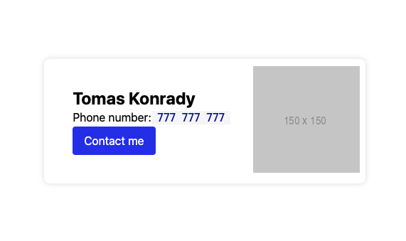

# Theme-ui

Cílem je vytvořit vizitku podobnou:



## Vytvořte komponentu InlineText
- Komponenta bude fungovat stejně jako [Text](https://theme-ui.com/components/text) ovšem místo tagu `div` použije `span`.

## Vytvořte komponentu Mono

- Komponenta obaluje InlineText
-  Nastylujte komponentu jako novou variantu `mono` textu v theme:
	- font-family používalo monospace font (vyuřijte alisu v `theme.fonts`)
	- využijte barev v `theme.colors` k nastylování barvy fontu a pozadí
	- nastavte horizontální padding

Použití:
```jsx
<Text>
	<InlineText>Phone number:</InlineText>
	<Mono>777 777 777</Mono>
</Text>
```
## Nastylujte komponentu `Card`
- `import { Card } from "theme-ui";`
- Komponenta `Card` hledá výchozí styl na určitém místě v `theme`. Najděte ho v dokumentaci.
- Nastylujte výchozí variantu takto:
```js
{
	padding: 2,
	borderRadius: 4,
	boxShadow: '0 0 8px rgba(0, 0, 0, 0.125)',
}
```

## Vytvořte aliasy
- Pro `boxShadow` a `borderRadius` na příslušná místa v theme.
- Použijte v Card variantě.

## Použijte Vytvořené komponenty

Násludující je markup, který použijeme
```jsx
<Card>
	<Flex sx={{ /* body */ }}>
		<Box sx={{ /* content */}}>
			<Heading>Tomas Konrady</Heading>
			<Text>
				<InlineText>Phone number:</InlineText>
				<Mono>777 777 777</Mono>
			</Text>
			<Button>
				Contact me
			</Button>
		</Box>
		<Box>
			
		</Box>
	</Flex>
</Card>
```
 Doplňte chybějící styly u `sx` atributů
 - "Flex.sx.body" - pomocí flexu vertikálně vycentrujte
 - "Box.sx.content" - přidejte padding, který se responzivně mění.

"Zprovozněte" tlačítko
- Použijte `as` atribute tak, aby tlačítko použilo `<a>` místo `<button>`.
- Doplňte `href="tel://777777777"` property do Button

# Hints

- [theme-ui/components](https://theme-ui.com/components):
- [Theme reference](https://styled-system.com/theme-specification#key-reference)
- [Flexbox](https://css-tricks.com/snippets/css/a-guide-to-flexbox/)
